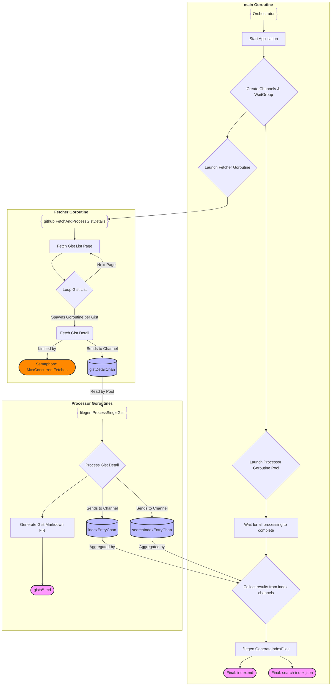

# Go Backend Architecture

This document details the Go application that fetches and processes Gists.

## Flow Diagram

This diagram illustrates a three-stage concurrent pipeline: Fetch, Process, and Aggregate.

1. Initialization (main Goroutine):

- The application starts in the main goroutine.
- It initializes several channels:
  - gistDetailChan: To pass fully-detailed gist objects from the fetcher to the processors.
  - indexEntryChan: To pass index metadata for the main index.md file.
  - searchIndexEntryChan: To pass data for the search-index.json file.
- It also creates a sync.WaitGroup to know when all processing is complete.

2. Stage 1: Fetching Gists (Concurrent Fetchers):

- The main goroutine launches a single goroutine for github.FetchAndProcessGistDetails.
- This "Fetcher" goroutine fetches the list of all gists from the GitHub API, handling pagination.
- For each gist in the list, it spawns a new, short-lived "Detail Fetcher" goroutine.
- The number of concurrent "Detail Fetcher" goroutines is limited by a semaphore (MaxConcurrentFetches) to avoid overwhelming the API.
- Each "Detail Fetcher" goroutine fetches the complete details for one gist and sends the model.GistDetail object into the gistDetailChan.

3. Stage 2: Processing Gists (Concurrent Processors):

- The main goroutine starts a pool of "Processor" goroutines (or, as implemented, a loop that spawns them). These processors listen on the gistDetailChan.
- When a GistDetail object is received, a filegen.ProcessSingleGist goroutine handles it.
- This processor performs two main tasks:
  1. Generates an individual markdown file for the gist (e.g., gists/GIST_ID.md).
  1. Creates IndexEntry and SearchIndexEntry structs and sends them into their respective channels (indexEntryChan and searchIndexEntryChan).

4. Stage 3: Aggregation and Finalization (main Goroutine):

- The main goroutine waits for all fetchers and processors to finish their work (coordinated via the WaitGroup).
- Once complete, it drains the indexEntryChan and searchIndexEntryChan, collecting all the generated entries into slices.
- Finally, it calls filegen.GenerateIndexFiles with the collected data to create the final index.md and search-index.json files.

This architecture effectively decouples fetching from processing and leverages concurrency to perform network I/O and file generation in parallel, significantly speeding up the build process.



______________________________________________________________________

## 1. Overview

The Go backend is the core of the Gist Archiver. It is a command-line application responsible for:

- Fetching all public gists for a specific GitHub user.
- Processing each gist's content into both Markdown and HTML formats.
- Generating a static HTML website for browsing the archived content, including a client-side search index.

The application is built with concurrency in mind to efficiently handle multiple API requests and file processing tasks simultaneously.

______________________________________________________________________

## 2. Project Structure

The Go-related parts of the project follow standard layout conventions:

```
/cmd
  /archiver         # Main application entrypoint
/internal
  /config           # Application configuration
  /filegen          # Markdown and HTML file generation
  /github           # GitHub API client
  /model            # Data models (structs)
go.mod
go.sum
```

- **/cmd/archiver**: Contains the `main` package, which is the entry point of the application. Its role is to initialize and coordinate the different components.
- **/internal**: Contains the core application logic, separated into packages with distinct responsibilities. This code is not intended to be imported by other projects.

______________________________________________________________________

## 3. Package Details

### `internal/config`

This package centralizes all application-wide constants, such as API endpoints, directory paths, and concurrency settings. This makes configuration easy to manage from a single location.

### `internal/model`

This package defines all the primary data structures (structs) used throughout the application. These models represent entities like `GistDetail`, `GistFile`, and `IndexEntry`, which are used for processing data from the GitHub API and generating the final archive.

### `internal/github`

This package provides a client for interacting with the GitHub Gists API. Its responsibilities include:

- Making authenticated API requests using a personal access token.
- Fetching the list of all public gists for a user, handling API pagination.
- Fetching the detailed content for each individual gist.
- Managing concurrent API requests to improve performance.

### `internal/filegen`

This package is responsible for generating all static files. Its key functions are:

- **Markdown Generation**: Creates a composite Markdown file for each gist, combining all of its file contents with metadata.
- **HTML Conversion**: Converts the generated Markdown into static HTML pages, including syntax highlighting for code blocks via `gomarkdown`.
- **Index File Creation**: Generates `index.md` and `index.html` to list all archived gists, sorted by date.
- **Search Index Generation**: Creates a JSON file containing the data needed for the client-side search. This index is consumed by Lunr.js on the frontend.

______________________________________________________________________

## 4. Execution Flow

The application's execution is orchestrated in `cmd/archiver/main.go` and relies heavily on goroutines and channels for concurrency.

1. **Initialization**: The `main` function starts by creating the necessary output directories.
1. **Channels**: Two buffered channels are created to manage the flow of data between concurrent stages:
   - `gistDetailChan`: To pass `GistDetail` objects from the API fetcher to the file processors.
   - `indexEntryChan`: To pass `IndexEntry` objects from the processors to the final index generator.
1. **Goroutines**: The application launches several goroutines to work in parallel:
   - A single **fetcher goroutine** fetches gist details from the GitHub API and sends them into `gistDetailChan`. Once all gists are fetched, it closes this channel.
   - A pool of **processor goroutines** reads from `gistDetailChan`. Each worker processes one gist at a time (generating its Markdown and HTML pages) and sends an `IndexEntry` into `indexEntryChan`.
   - A single **indexer goroutine** collects all `IndexEntry` items from `indexEntryChan`. Once the channel is closed, it sorts the entries by date and generates the final `index.html`, `index.md`, and search index files.
1. **Synchronization**: `sync.WaitGroup` is used to ensure that all steps complete in the correct order. The main function waits for fetching, processing, and indexing to complete before exiting.

This concurrent model allows the application to overlap network I/O (fetching gists) with CPU-bound work (processing files), significantly speeding up the archival process.
