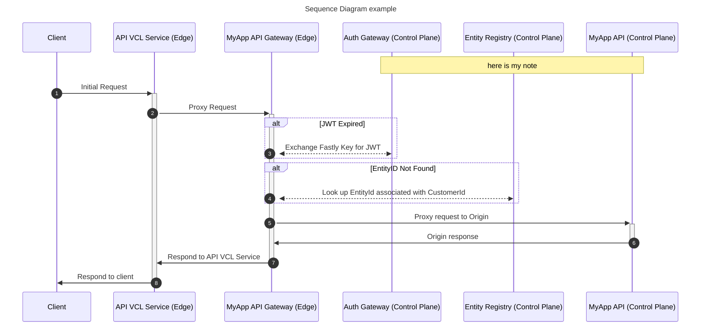
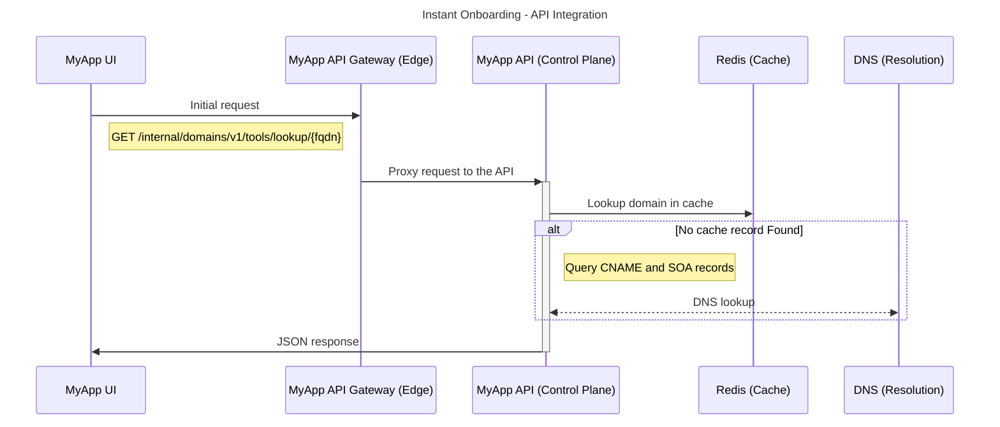
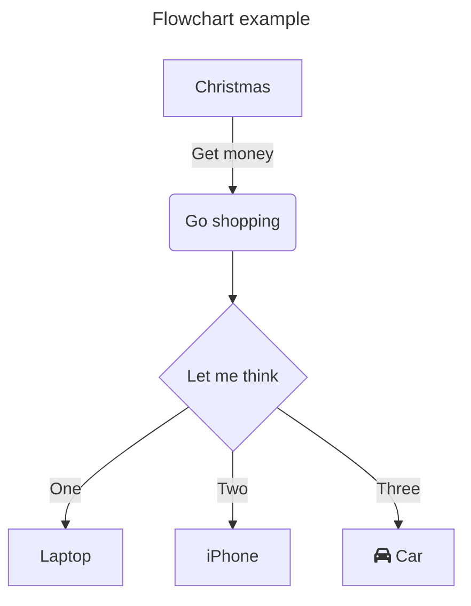
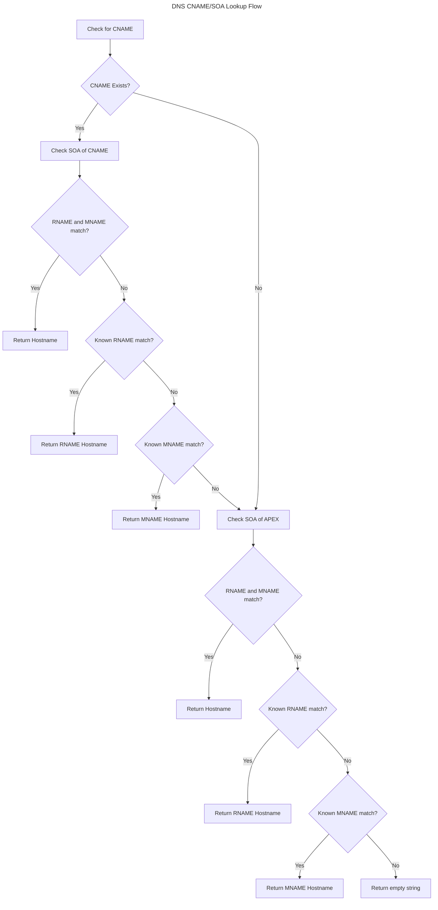
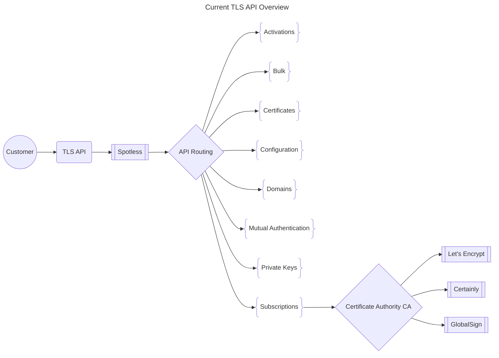
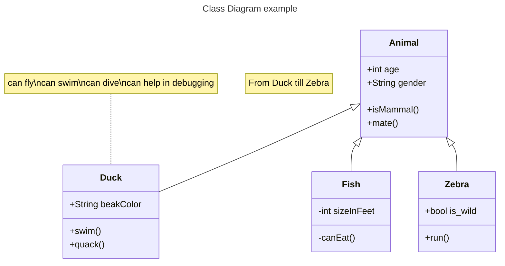
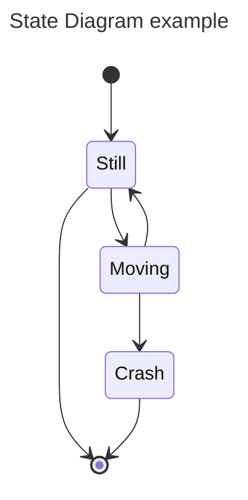
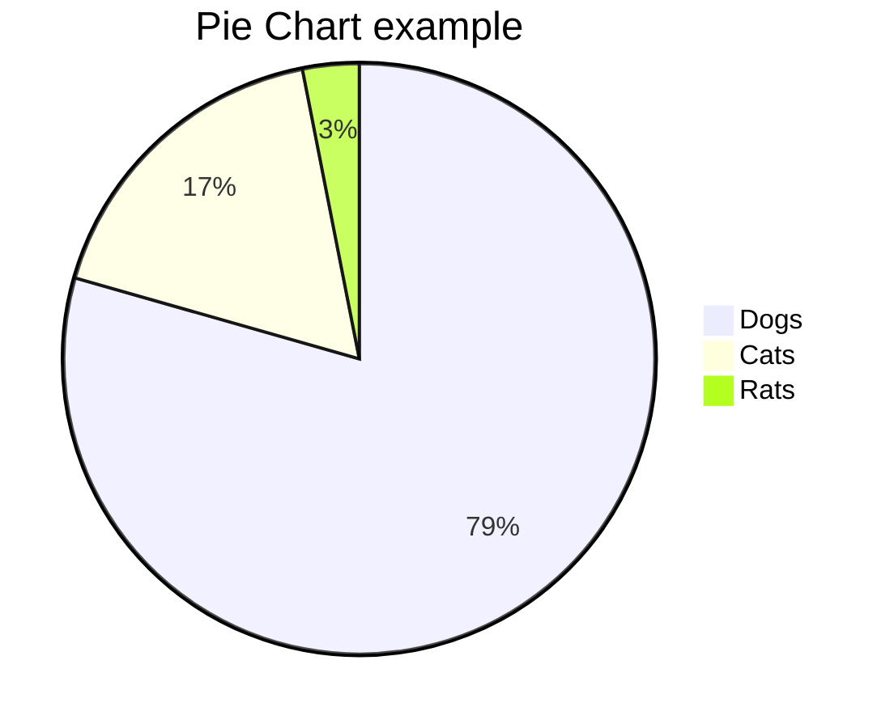
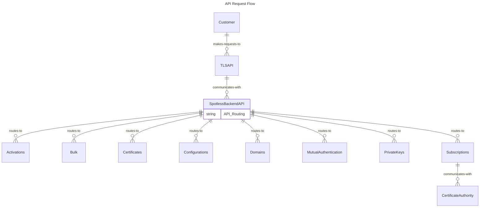
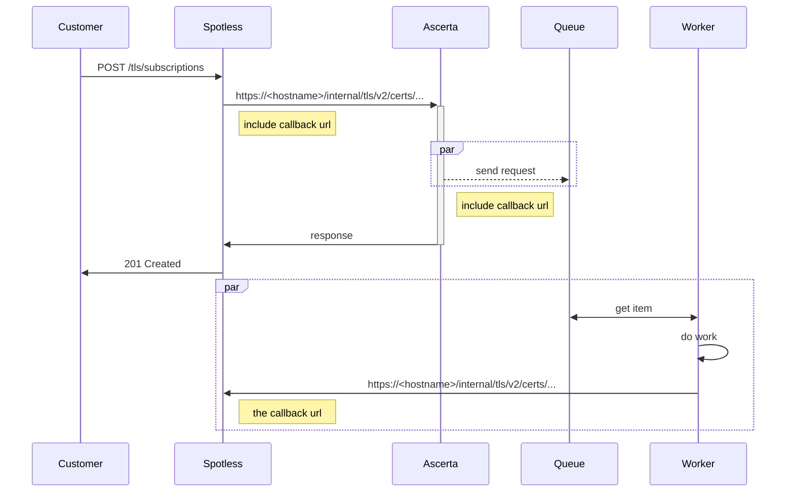

# Mermaid Diagram Examples 

[View original Gist on GitHub](https://gist.github.com/Integralist/228d1c8b0d309a41de67afe09111f4eb)

**Tags:** #diagrams

## Mermaid Example.md

https://mermaid.js.org/  
https://mermaid.live/



> [!NOTE]
> The yellow box is rendered by use of `+` and `-` before the target names.\
> e.g. `cl->>+avs: Initial Request` finishes with `avs->>-cl: Respond to client`

> [!TIP]
> Use `autonumber` to automatically number lines!

> [!TIP]
> You can comment out lines using `%%`.






> [!NOTE]
> `TB` - Top to bottom\
> `TD` - Top-down/ same as top to bottom\
> `BT` - Bottom to top\
> `RL` - Right to left\
> `LR` - Left to right

> [!TIP]
> For a flowchart, you can use either `flowchart` or `graph` (see below for example).
















Below is an example of drawing boxes around specific parts of a system...

```mermaid
sequenceDiagram
    participant EU as End User
    participant RR as Recursive Resolver
    participant Root as Root Servers
    participant TLD as .com TLD Servers
    participant DS as DNSimple Servers <br/> (IPs via Glue Records for nsX.example.com)
    participant Cust as Customer
    participant UI as Example UI
    participant BE as Example Facade API Service
    participant API as DNSimple API
    participant DB as DNSimple Database

    box LightBlue DNS Resolution Process (Query for www.customerdomain.com)
        participant EU
        participant RR
        participant Root
        participant TLD
    end

    box Pink Record Management Process (Customer updates DNS)
        participant Cust
        participant UI
        participant BE
        participant API
    end

    Note over EU, DS: Initial Setup Prerequisite (Not Shown):<br/>1. Vanity NS (nsX.example.com) configured in DNSimple.<br/>2. Glue Records created at example.com's registrar mapping nsX.example.com to DNSimple IPs.<br/>3. customerdomain.com's NS records point to nsX.example.com.

    %% === DNS Resolution Flow ===
    EU->>+RR: Resolve www.customerdomain.com?
    RR->>+Root: Who handles .com?
    Root-->>-RR: TLD Server IPs
    RR->>+TLD: Who handles customerdomain.com?
    TLD-->>-RR: NS: ns1.example.com @ DNSimple_IP1<br/>NS: ns2.example.com @ DNSimple_IP2<br/>(Info via Glue Records)
    RR->>+DS: (Query sent to DNSimple_IP1) A record for www.customerdomain.com?
    DS-->>-RR: A record is 192.0.2.100
    RR-->>-EU: www.customerdomain.com is 192.0.2.100
    EU->>(Web Server): Connect to 192.0.2.100

    %% === Record Management Flow ===
    Cust->>+UI: Login & Navigate to manage.example.com
    Cust->>UI: Request Add/Update Record (e.g., TXT _foo="bar")
    UI->>+BE: Submit Record Change Request (domain, type, name, content)
    BE->>+API: Create/Update Record via DNSimple API<br/>(Zone: customerdomain.com, Record Details)
    API->>+DB: Store/Update record data in DNSimple's database
    Note over DB, DS: DNSimple internal propagation<br/>updates authoritative servers (DS).
    DB-->>-API: Confirmation of data update
    API-->>-BE: Success Response (e.g., Record ID)
    BE-->>-UI: Operation Successful
    UI-->>-Cust: Display success message / updated record list

    Note right of DS: DNSimple Servers (DS)<br/>now serve the<br/>new/updated record<br/>for future queries.
```

