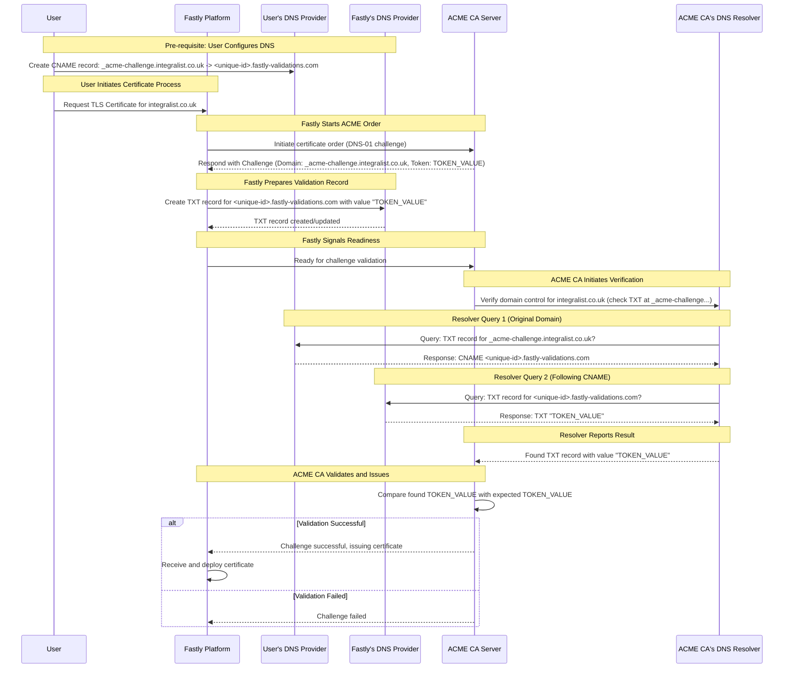

# DNS Delegation #dns

[View original Gist on GitHub](https://gist.github.com/Integralist/b50604c682e5ba91208f650147280596)

## DNS Delegation.md

## DNS Management and Delegation

If a domain owner wants to use another company for handling DNS management over its domain, then they can update the "Name Servers" for their domain wherever DNS is currently managed, and set the Name Servers to a different DNS provider. 

This is known as DNS _delegation_.

Once that Name Server change has propagated, the new DNS provider will be responsible for managing DNS records for the domain.

## CNAME redirection magic

Through a CNAME, a domain owner can delegate the DNS resolution for a specific hostname to another service, enabling that service to provide the necessary records (like TXT) for that name.

## Example

So as an example, let's say I'm onboarding my domain `integralist.co.uk` with Fastly and Fastly is going to manage a TLS certificate for me using a popular Certificate Authority (CA) such as Let's Encrypt.

The CA (as part of `dns-01` ACME validation) needs to prove that I own the domain before it will issue a certificate. So it asks that the domain owner create a TXT record like `_acme-challenge.integralist.co.uk` with a specific value. It'll then check if that has been done, and if so, it'll issue a TLS certificate.

Now I (as the domain owner) am not communicating with the CA. Fastly is. So Fastly is the one being given the information from the CA as to the TXT record that needs to be created. But Fastly doesn't show me that information. That's because Fastly wants to be responsible for managing TLS certificate _renewals_. It would be annoying if Fastly had to keep coming back to me (as the domain owner) every time the TLS certificate was going to expire and ask me to update my DNS each time with whatever new TXT challenge record the CA is asking to be created to verify domain ownership.

So, Fastly instead asks me to create a CNAME record called `_acme-challenge.integralist.co.uk`. This record name is the same as the TXT record name the CA is expecting, but importantly, it's a CNAME record, not a TXT record. 

Fastly will ask me to create this CNAME record with a value like `<unique-id>.fastly-validations.com`.

Now remember, the CA itself is expecting a TXT record called `_acme-challenge.integralist.co.uk` to be created.

Standard DNS resolver behavior dictates that when looking for a specific record type (like TXT) and encountering a CNAME, the resolver should restart the query for the original record type but using the target of the CNAME.

> [!NOTE]
> To be clear, the DNS resolver doesn't _choose_ to look at the CNAME instead of the TXT; rather, when it asks for the TXT record, the authoritative server responds with the CNAME because:
>
> a) The CNAME exists for that name.\
> b) The DNS rules forbid a TXT record (or most other types) from existing at the same name as the CNAME.
>
> Receiving the CNAME record triggers the standard resolver behavior to follow the alias and re-query for the original record type (TXT) at the target name. It "automatically sees the CNAME" because that's the data the authoritative server provides in response to its TXT query, due to the CNAME's exclusive nature.

This means, it'll restart the query for the TXT record but will look for `<unique-id>.fastly-validations.com` as the value.

The DNS will naturally follow the `<unique-id>.fastly-validations.com` to where Fastly controls the DNS, and Fastly has set-up that TXT record with the secret TXT value that the CA originally asked for.

## Diagram

The following is a very rough proximation of steps...

